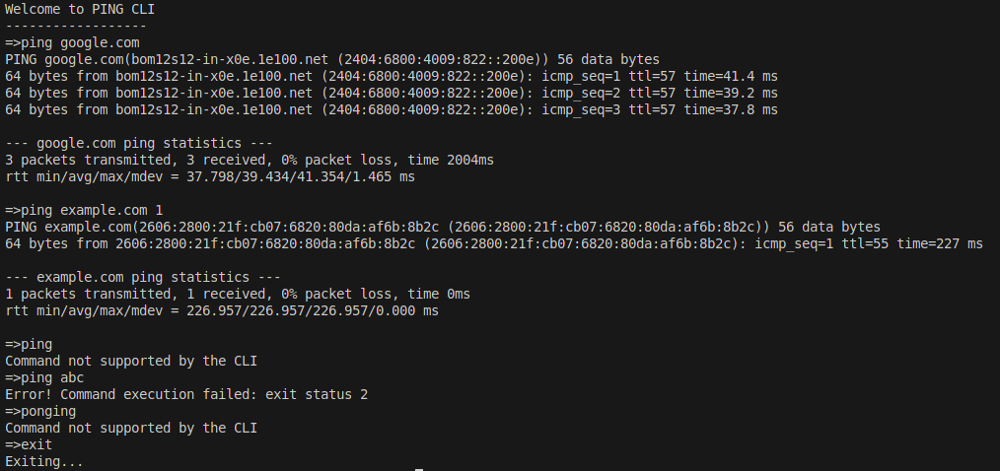

# Welcome to README of pingcli

Pingcli is a demo project showcasing Golang's ability to create CLI utilities and execute os commands programatically.

I have created a simple CLI program that keeps on accepting user input using bufio Scanner from STDIN and execute the command.
It supports two commands: exit and ping (with IP/url and count as parameters)

Sample execution:
